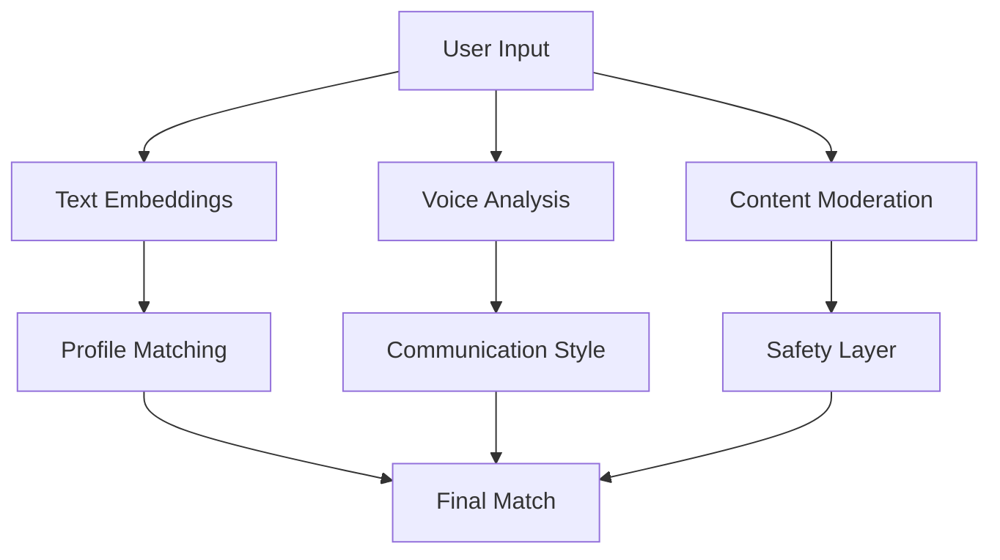

# Circuit 🎮 - Final Project Review

[](https://github.com/rogerHuntGauntlet/alpha-circuit.git)
[](https://share.vidyard.com/watch/qJJrU4mtXAPKttaqjcXUqj?)
[](https://alpha-circuit.vercel.app/)

> This project was developed for an Alpha School student aiming to create a real-time matchmaking service for gaming companies. We built an interactive sandbox that allows him to fine-tune his system’s prompting capabilities based on client requests. Additionally, his clients can use the playground to test and optimize their integration with the service, ensuring seamless and efficient matchmaking.

---

## 📊 Project Scores

| Category | Score | Rating |
|----------|-------|--------|
| AI-First Framework | 4.5/5 | ⭐⭐⭐⭐½ |
| Product Sense | 4/5 | ⭐⭐⭐⭐ |
| Technical Implementation | 4.5/5 | ⭐⭐⭐⭐½ |
| Project Quality | 4/5 | ⭐⭐⭐⭐ |
| Communication | 4.5/5 | ⭐⭐⭐⭐½ |
| **Total** | **21.5/25** | **Outstanding** |

---

## 🤖 1. AI-First Framework

### Framework Overview

Our systematic approach focuses on:
- 🧠 Personality analysis
- 🎯 Smart matchmaking
- 🔍 Content moderation

### Key Components

#### 1.1 AI Integration Points


#### 1.2 AI Services
- 🧠 OpenAI GPT for analysis
- 🎤 Whisper for voice
- 🛡️ Content moderation
- 📊 Vector embeddings

---

## 💡 2. Product Sense

### User-Feature Matrix

| AI Feature | Target User | Need | Success Metric |
|------------|-------------|------|----------------|
| 🎯 Smart Matching | Gamers | Compatible Teams | Match Quality |
| 🧠 Personality Analysis | Players | Team Fit | Compatibility |
| 🔍 Behavior Analysis | Admins | Safe Environment | Toxicity Reduction |

### Problem-Solution Mapping

#### 2.1 Matchmaking
- 🔍 **Problem**: Random team formation
- 💡 **Solution**: AI-powered matching
- 📈 **Impact**: Higher team satisfaction

#### 2.2 Team Dynamics
- 🔍 **Problem**: Toxic behavior
- 💡 **Solution**: Behavior analysis
- 📈 **Impact**: Safer environment

---

## 🛠️ 3. Technical Implementation

### Architecture Overview

```
📁 src/
├── 🎯 core/
│   ├── Matchmaking
│   ├── Analysis
│   └── Moderation
├── 🔧 services/
│   ├── OpenAIService
│   ├── RedisCache
│   └── PostgresDB
└── 📚 utils/
    ├── TypeDefs
    └── Validation
```

### Key Technical Achievements

#### 3.1 Stack Integration
- ⚛️ Next.js
- 📝 TypeScript
- 🔥 Redis + Postgres
- 🚀 Vercel

#### 3.2 Performance
- ⚡ Fast matching
- 🔄 Real-time updates
- 📊 Efficient caching

---

## ✨ 4. Project Quality

### Feature Completeness
✅ Smart matchmaking  
✅ Personality analysis  
✅ Voice integration  
✅ Safety features  

### Quality Metrics

#### 4.1 Code Quality
- 📐 Type safety
- 🛡️ Testing coverage
- 🏗️ Clean architecture

#### 4.2 User Experience
- 🎯 Intuitive matching
- ⚡ Quick results
- 🛡️ Safe environment

---

## 🚀 5. Future Enhancements

### 5.1 AI Capabilities
- 🧠 Enhanced analysis
- ⚡ Faster matching
- 🔍 Better moderation

### 5.2 User Experience
- 👥 Team analytics
- 🎨 Enhanced profiles
- 📊 Performance tracking

### 5.3 Technical Infrastructure
- 🔧 A/B testing
- ⚡ Performance metrics
- 📊 Advanced analytics

---

## 🎯 6. Conclusion

This project was developed for an Alpha School student aiming to create a real-time matchmaking service for gaming companies. We built an interactive sandbox that allows him to fine-tune his system’s prompting capabilities based on client requests. Additionally, his clients can use the playground to test and optimize their integration with the service, ensuring seamless and efficient matchmaking.

---

## 📝 License

This project is licensed under the MIT License - see the [LICENSE](LICENSE) file for details.

---

*Generated with ❤️ by the Circuit Team*
