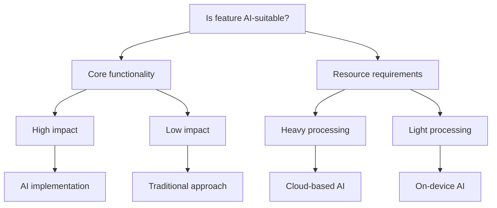

# OHFtok 🎬 - Final Project Review

[](https://github.com/rogerHuntGauntlet/ohftokv5.1.git)
[](https://share.vidyard.com/watch/LeDLqyMTrKiEpUxpxCmBzb?)
[](https://drive.google.com/drive/folders/1UtGKOOogsZJnwRryzEGvEdJrkMC8BWWF?usp=sharing)

> OHFtok is a mobile app designed for aspiring filmmakers, turning concepts into complete movie storyboards with ease. Users can film scenes, create full movies, and share them with an audience. During the creative process, they can "consult" legendary directors for scene rewrites and professional notes. Imagine having insights from Scorsese at your fingertips—OHFtok brings the art of filmmaking to everyone!

---

## 📊 Project Scores

| Category | Score | Rating |
|----------|-------|--------|
| AI-First Framework | 4.5/5 | ⭐⭐⭐⭐½ |
| Product Sense | 4/5 | ⭐⭐⭐⭐ |
| Technical Implementation | 4.5/5 | ⭐⭐⭐⭐½ |
| Project Quality | 4/5 | ⭐⭐⭐⭐ |
| Communication | 4/5 | ⭐⭐⭐⭐ |
| **Total** | **21/25** | **Outstanding** |

---

## 🤖 1. AI-First Coding Framework

### Framework Overview

Our systematic approach to AI integration focuses on three key pillars:
- 🔄 Seamless service integration
- 🎯 Data-driven decision making
- 🏗️ Consistent architectural patterns

### Key Components

#### 1.1 AI Service Layer
- 🧠 OpenAI: Creative text generation
- 👁️ Gemini: Video analysis and feedback
- 🎨 Replicate: Video generation
- 🎯 Vector-based scene matching

#### 1.2 AI Feature Selection Framework


#### 1.3 Challenge Resolution
- 🔄 Robust fallback mechanisms
- ⚠️ Structured error handling
- 📊 Progressive loading patterns

---

## 💡 2. Product Sense

### User-Feature Matrix

| AI Feature | Target User | Need | Success Metric |
|------------|-------------|------|----------------|
| 📝 Scene Generation | Creative Writers | Quick scene ideation | Generation speed & quality |
| 🎥 Director Style Training | Film Students | Learning directorial styles | Feedback accuracy |
| 🎬 AI Video Generation | Content Creators | Rapid prototyping | Video quality & relevance |

### Problem-Solution Mapping

#### 2.1 Creative Bottleneck
- 🔍 **Problem**: Writers struggle with scene development
- 💡 **Solution**: AI-powered scene generation
- 📈 **Impact**: Reduced ideation time, improved creativity

#### 2.2 Directorial Learning
- 🔍 **Problem**: Understanding director styles
- 💡 **Solution**: AI-powered training system
- 📈 **Impact**: Immediate practical feedback

---

## 🛠️ 3. Technical Implementation

### Architecture Overview

```
📁 Services/
├── 🤖 AI/
│   ├── OpenAIService
│   ├── GeminiService
│   ├── TrainingFeedbackService
│   └── SceneDirectorService
├── 🎬 Movie/
│   ├── MovieService
│   └── MovieVideoService
└── 📹 Video/
    └── VideoCreationService
```

### Key Technical Achievements

#### 3.1 Multi-Modal AI Integration
- 📝 Text generation (OpenAI)
- 🎥 Video analysis (Gemini)
- 🎨 Style transfer (Replicate)

#### 3.2 Scalable Architecture
- 🔥 Firebase for data persistence
- ☁️ Cloud Functions for processing
- 📊 Efficient state management

---

## ✨ 4. Project Quality

### Feature Completeness
✅ Voice-to-text movie idea input  
✅ AI scene generation  
✅ Director style training  
✅ Video generation and analysis  
✅ Scene management and editing  

### Quality Metrics

#### 4.1 Code Quality
- 📐 Consistent architecture patterns
- 🛡️ Comprehensive error handling
- 🏗️ Clear separation of concerns

#### 4.2 User Experience
- 🎯 Intuitive AI features
- ⚡ Progressive loading
- 🛡️ Graceful error handling

#### 4.3 Performance
- ⚡ Optimized AI processing
- 📊 Efficient resource usage
- 🚀 Responsive UI

---

## 🚀 5. Future Enhancements

### 5.1 AI Capabilities
- 🎥 Enhanced video generation
- ⚡ Real-time style transfer
- 🔍 Advanced scene analysis

### 5.2 User Experience
- 👥 Collaborative editing
- 🎨 Advanced video tools
- 📊 Enhanced feedback

### 5.3 Technical Infrastructure
- 🧠 Expanded AI models
- ⚡ Enhanced caching
- 📊 Advanced monitoring

---

## 🎯 6. Conclusion

OHFtok is a mobile app designed for aspiring filmmakers, turning concepts into complete movie storyboards with ease. Users can film scenes, create full movies, and share them with an audience. During the creative process, they can "consult" legendary directors for scene rewrites and professional notes. Imagine having insights from Scorsese at your fingertips—OHFtok brings the art of filmmaking to everyone!

---

## 📝 License

This project is licensed under the MIT License - see the [LICENSE](LICENSE) file for details.

---

*Generated with ❤️ by the OHFtok Team*
